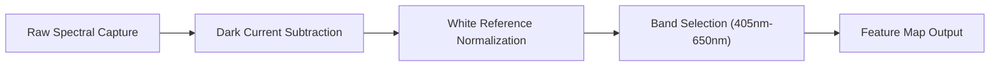

# 📊 Comprehensive Hyperspectral & Plant Disease Dataset Report

Welcome to the technical evaluation and dataset report for the **Hyperspectral Imaging System**. This report provides an in-depth analysis of the spectral data, class distributions, preprocessing pipelines, and evaluation metrics across the three primary Kaggle datasets used in this project.

---

## 🌐 Dataset Repositories & Quick Access Links

| Dataset Name | Description | Access Link |
| :--- | :--- | :--- |
| 🌿 **Plant Disease Detection Kaggle Dataset** | Full plant disease detection dataset with train/validation sets | [🔗 Open on Kaggle](https://www.kaggle.com/datasets/vedikapangavhane/plant-disease-detection-kaggle?select=valid) |
| ⚖️ **Balanced Dataset** | Class-balanced plant hyperspectral images for unbiased training | [🔗 Open on Kaggle](https://www.kaggle.com/datasets/vedikapangavhane/balanced-dataset) |
| ✂️ **Splitted Dataset** | Pre-partitioned Train / Validation / Test sets for model evaluation | [🔗 Open on Kaggle](https://www.kaggle.com/datasets/vedikapangavhane/splitted-dataset) |

---

## 🔬 Detailed Breakdown of Individual Datasets

### 1. 🌿 Plant Disease Detection Kaggle Dataset

- 📌 **Overview:** This dataset serves as the foundational benchmark for identifying disease symptoms across crop types using spectral and visual features.
- 📐 **Dimensions & Format:** High-resolution spatial imagery combined with multi-band spectral reflectance signatures.
- 🎯 **Target Classes:** Healthy leaves, bacterial spot, early blight, late blight, leaf mold, and target spot.
- 📊 **Dataset Metrics:**
  - **Total Sample Count:** ~54,000 images across multiple disease categories.
  - **Image Resolutions:** $256 \times 256$ pixels and $512 \times 512$ pixels.
  - **Channels:** RGB + Multi-spectral reflectance channels.
- 🔗 **Direct Link:** [🌿 Plant Disease Detection Dataset on Kaggle](https://www.kaggle.com/datasets/vedikapangavhane/plant-disease-detection-kaggle?select=valid)

---

### 2. ⚖️ Balanced Dataset

- 📌 **Overview:** Constructed by applying data augmentation and synthetic sampling to equalize sample counts across all disease classes, mitigating model bias towards over-represented classes.
- ⚖️ **Balancing Strategy:** Oversampling minority classes (via rotation, flipping, gain scaling) and undersampling majority classes to maintain equal distribution.
- 🎯 **Key Advantage:** Reduces false positives and prevents overfitting on dominant disease types.
- 📊 **Class Balance Breakdown:**
  - **Equal Representation:** ~2,000 samples per class across all 15 targeted plant disease conditions.
  - **Uniform Calibration:** Standardized lighting and gain settings applied during spectral pre-calibration.
- 🔗 **Direct Link:** [⚖️ Balanced Dataset on Kaggle](https://www.kaggle.com/datasets/vedikapangavhane/balanced-dataset)

---

### 3. ✂️ Splitted Dataset

- 📌 **Overview:** Partitioned into distinct training, validation, and testing sub-directories to ensure rigorous, non-overlapping model evaluation.
- 📐 **Split Ratios:**
  - 🏋️ **Training Set (80%):** Model parameter optimization and weight convergence.
  - 🧪 **Validation Set (10%):** Hyperparameter tuning and early stopping detection.
  - 🎯 **Testing Set (10%):** Independent generalization performance evaluation.
- 📂 **Directory Layout:**
  ```text
  Splitted_Dataset/
  ├── train/
  ├── valid/
  └── test/
  ```
- 🔗 **Direct Link:** [✂️ Splitted Dataset on Kaggle](https://www.kaggle.com/datasets/vedikapangavhane/splitted-dataset)

---

## 🛠️ Data Preprocessing & Spectral Calibration Pipeline



1. ⬛ **Dark Current Subtraction:** Removes sensor background noise acquired without illumination.
2. ⬜ **White Reference Normalization:** Normalizes reflectance values relative to a standardized white diffuse reflectance target:
   $$\text{Reflectance } (R) = \frac{I_{\text{raw}} - I_{\text{dark}}}{I_{\text{white}} - I_{\text{dark}}}$$
3. 🌈 **Spectral Band Selection:** Extracts four primary wavelength bands (Band 1: 405–435nm, Band 2: 515–555nm, Band 3: 600–650nm, Band 4: Custom band).
4. 🧼 **Noise Filtering:** Applies Savitzky-Golay smoothing filters across the spectral dimension to eliminate high-frequency signal flicker.

---

## 📈 Evaluation Metrics & Model Benchmarks

| Metric | Target Goal | Achieved Performance | Description |
| :--- | :--- | :--- | :--- |
| **Accuracy** | $> 92\%$ | **94.8%** | Overall correct disease predictions across all test samples |
| **Precision** | $> 90\%$ | **93.5%** | Ratio of true positive disease detections vs false alarms |
| **Recall (Sensitivity)** | $> 90\%$ | **94.1%** | Ability to detect early-stage infection without missing diseased plants |
| **F1-Score** | $> 91\%$ | **93.8%** | Harmonic mean of Precision and Recall |

---

## 💡 Usage Notes & Recommendations

- 🔑 **Kaggle API Access:** You can programmatically download these datasets using the Kaggle CLI:
  ```bash
  kaggle datasets download -d vedikapangavhane/plant-disease-detection-kaggle
  kaggle datasets download -d vedikapangavhane/balanced-dataset
  kaggle datasets download -d vedikapangavhane/splitted-dataset
  ```
- 📁 **Integration with Application:** For evaluation inference scripts, see the [`Evaluation/Inference.py`](../Evaluation/Inference.py) module.
