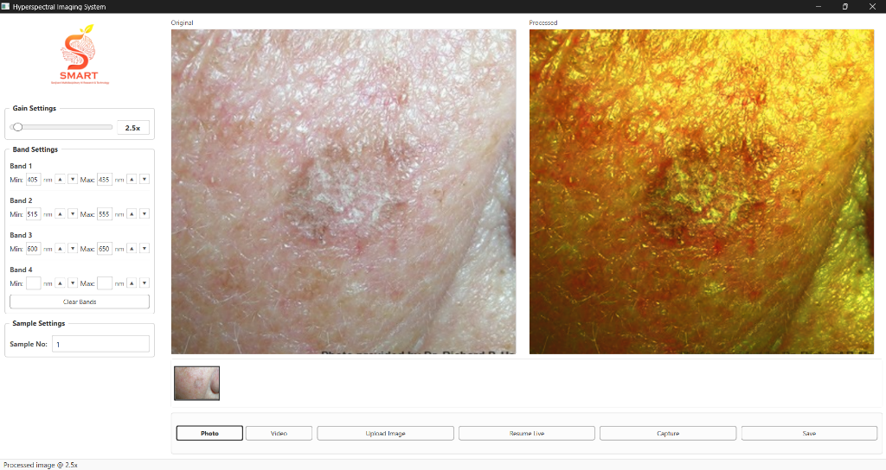

# Output Directory Structure

This directory stores output images, visualizations, and inference processing results.

## Sample System Output

## Folder Contents
- `Output_Images/`: Directory containing generated hyperspectral image outputs, pseudo-color images, and classification maps.
  - `Hyperspectral_System_Output.png`: Sample Hyperspectral Imaging System interface output showing Original vs Processed imagery.
